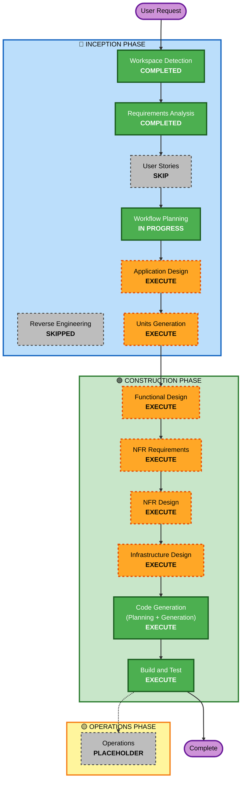

# Execution Plan: Skill2Hire - Placement Prediction AI Web App

## Detailed Analysis Summary

### Project Type
**Greenfield Project** - Building from scratch with no existing codebase

### Transformation Scope
Not applicable (greenfield project)

### Change Impact Assessment

**User-facing changes**: **Yes**
- Complete web application with interactive UI
- Student input forms with real-time validation
- Prediction results display with visualizations
- College-wide insights dashboard
- Resume upload interface

**Structural changes**: **Yes**
- New full-stack architecture (Flask backend + HTML/CSS/JS frontend)
- ML pipeline integration
- Database integration (Supabase)
- API layer design

**Data model changes**: **Yes**
- Student profile data model
- Prediction results schema
- Job description storage
- Analytics aggregation tables

**API changes**: **Yes**
- New REST API endpoints (/predict, /analyze-job, /insights)
- JSON request/response contracts
- Rate limiting implementation

**NFR impact**: **Yes**
- Performance requirements (<5 second response)
- Security baseline enforcement (15 rules)
- Accessibility compliance (WCAG 2.1 AA)
- Monitoring and logging infrastructure

### Risk Assessment
- **Risk Level**: **Medium-High**
  - Complex ML integration with multiple models
  - Full-stack development with multiple technologies
  - Security baseline enforcement requirements
  - Production deployment with CI/CD automation
  
- **Rollback Complexity**: **Moderate**
  - Containerized deployment allows easy rollback
  - Database migrations need careful handling
  - Model versioning in Git provides recovery path
  
- **Testing Complexity**: **Moderate-Complex**
  - ML model testing (accuracy, predictions)
  - API endpoint testing
  - Frontend integration testing
  - Security compliance verification

---

## Workflow Visualization

---

## Phases to Execute

### 🔵 INCEPTION PHASE

#### ✅ Completed Stages

- [x] **Workspace Detection** - COMPLETED
  - Determined greenfield project
  - No existing code found
  
- [x] **Reverse Engineering** - SKIPPED
  - Not applicable for greenfield project
  
- [x] **Requirements Analysis** - COMPLETED
  - Comprehensive requirements document created
  - 21 clarifying questions answered
  - Extensions configured (Security: Yes, PBT: Partial)

#### ⏭️ Skipped Stages

- [ ] **User Stories** - SKIP
  - **Rationale**: While this is a user-facing application, the requirements are exceptionally clear and comprehensive. The detailed functional requirements (FR-01 through FR-19) already specify exact user interactions, input fields, outputs, and workflows. User stories would be redundant given the level of detail already captured. The project has a single primary user type (students seeking placement prediction) with straightforward use cases that are fully documented in the requirements.

#### 🔄 Current Stage

- [x] **Workflow Planning** - IN PROGRESS
  - Creating execution plan
  - Determining stage sequence

#### 📋 Upcoming Stages

- [ ] **Application Design** - EXECUTE
  - **Rationale**: This is a complex multi-component system requiring clear architectural design. Need to define:
    - Component structure (ML pipeline, API layer, frontend, database layer)
    - Service boundaries and responsibilities
    - Data flow between components
    - Integration points (Flask ↔ ML models, Flask ↔ Supabase, Frontend ↔ API)
    - Design patterns for ensemble model management
    - NLP processing module design
  
- [ ] **Units Generation** - EXECUTE
  - **Rationale**: The system naturally decomposes into multiple logical units that can be developed in parallel:
    - **Unit 1**: ML Pipeline (dataset generation, model training, model evaluation)
    - **Unit 2**: Backend API (Flask endpoints, business logic, Supabase integration)
    - **Unit 3**: Frontend (UI components, forms, visualizations, resume upload)
    - **Unit 4**: DevOps (Docker, GitHub Actions, deployment configuration)
    - Each unit has clear boundaries and can be developed independently with defined integration points

---

### 🟢 CONSTRUCTION PHASE

All per-unit design stages will execute for each unit identified in Units Generation.

#### Per-Unit Design Stages (Execute for Each Unit)

- [ ] **Functional Design** - EXECUTE
  - **Rationale**: Each unit requires detailed functional design:
    - **ML Pipeline**: Data preprocessing logic, feature engineering, model training algorithms, evaluation metrics
    - **Backend API**: Request validation, prediction orchestration, NLP processing, database operations
    - **Frontend**: Form handling, result display logic, chart rendering, file upload processing
    - **DevOps**: Pipeline stages, deployment steps, environment configuration

- [ ] **NFR Requirements** - EXECUTE
  - **Rationale**: Significant NFR requirements must be addressed:
    - Performance: <5 second prediction response time
    - Security: 15 security baseline rules to enforce
    - Accessibility: WCAG 2.1 Level AA compliance
    - Monitoring: Comprehensive logging and metrics
    - Scalability: Rate limiting, concurrent request handling
    - Tech stack selection and justification needed

- [ ] **NFR Design** - EXECUTE
  - **Rationale**: NFR requirements require specific design patterns:
    - Caching strategy for model predictions
    - Rate limiting implementation (Flask-Limiter)
    - Security headers middleware
    - Input validation framework
    - Logging infrastructure (structured logging)
    - Error handling patterns
    - Accessibility implementation (ARIA labels, semantic HTML)

- [ ] **Infrastructure Design** - EXECUTE
  - **Rationale**: Complex infrastructure requirements:
    - Supabase database schema and tables
    - Render deployment configuration
    - Docker container setup
    - GitHub Actions workflow stages
    - Environment variable management
    - Model storage strategy (Git LFS or repository)
    - Log aggregation service selection

#### Always-Execute Stages

- [ ] **Code Generation** - EXECUTE (ALWAYS)
  - **Part 1 - Planning**: Create detailed implementation plan for each unit
  - **Part 2 - Generation**: Generate code, tests, and configuration files
  - **Rationale**: Core implementation phase - always required

- [ ] **Build and Test** - EXECUTE (ALWAYS)
  - **Rationale**: Comprehensive testing and validation required:
    - Unit tests for ML models and API endpoints
    - Property-based tests for pure functions
    - Integration testing across units
    - Security compliance verification
    - Accessibility testing
    - Build instructions for local development
    - Deployment verification

---

### 🟡 OPERATIONS PHASE

- [ ] **Operations** - PLACEHOLDER
  - **Rationale**: Future deployment and monitoring workflows. Current build and test activities handled in CONSTRUCTION phase.

---

## Execution Sequence

### Phase 1: INCEPTION (Remaining Stages)
1. **Application Design** → Define architecture and components
2. **Units Generation** → Decompose into 4 parallel units

### Phase 2: CONSTRUCTION (Per-Unit Loop)
For each unit (ML Pipeline, Backend API, Frontend, DevOps):
1. **Functional Design** → Detailed business logic and algorithms
2. **NFR Requirements** → Assess NFR needs for this unit
3. **NFR Design** → Design NFR implementation patterns
4. **Infrastructure Design** → Map to infrastructure services
5. **Code Generation** → Plan and generate code

### Phase 3: CONSTRUCTION (Integration)
6. **Build and Test** → Integrate all units, comprehensive testing

---

## Estimated Timeline

- **Total Stages to Execute**: 11 stages
  - INCEPTION: 2 stages (Application Design, Units Generation)
  - CONSTRUCTION: 4 units × 5 stages = 20 per-unit stages + 1 Build & Test = 21 stages
  - **Total**: 23 stages

- **Estimated Duration**: 
  - INCEPTION: 2-3 interactions
  - CONSTRUCTION: 8-12 interactions (parallelizable by unit)
  - **Total**: 10-15 interactions

---

## Success Criteria

### Primary Goal
Build a production-ready AI-powered placement prediction web application that:
- Predicts placement probability for specific jobs using ensemble ML
- Provides actionable skill gap suggestions
- Displays college-wide insights with visualizations
- Meets all security and accessibility requirements
- Deploys automatically via CI/CD

### Key Deliverables
1. **ML Pipeline**: Trained ensemble models (RF, GB, LR, Voting) with >75% accuracy
2. **Backend API**: Flask REST API with 3 endpoints, rate limiting, security headers
3. **Frontend**: Responsive web UI with forms, charts, resume upload
4. **Database**: Supabase schema with 4+ tables
5. **DevOps**: Docker container, GitHub Actions CI/CD, Render deployment
6. **Documentation**: README, API docs, deployment guide
7. **Tests**: Unit tests, property-based tests, integration tests

### Quality Gates
- ✅ All unit tests pass
- ✅ Security baseline compliance (15 rules)
- ✅ WCAG 2.1 Level AA accessibility compliance
- ✅ API response time <5 seconds
- ✅ Model accuracy meets threshold
- ✅ CI/CD pipeline executes successfully
- ✅ Application deploys to Render without errors

---

## Risk Mitigation

### Technical Risks
1. **ML Model Accuracy**: Mitigate with proper dataset generation and hyperparameter tuning
2. **Performance**: Mitigate with caching, efficient algorithms, and load testing
3. **Security**: Mitigate with security baseline enforcement at each stage
4. **Integration Complexity**: Mitigate with clear unit boundaries and integration tests

### Process Risks
1. **Scope Creep**: Mitigate with clear requirements and change control
2. **Timeline Pressure**: Mitigate with parallel unit development
3. **Quality Compromise**: Mitigate with mandatory quality gates

---

## Notes

- **Adaptive Detail**: Each stage will adapt detail level to problem complexity
- **Parallel Development**: Units can be developed in parallel after Units Generation
- **Checkpoint Approvals**: User approval required at each major stage completion
- **Extension Enforcement**: Security baseline rules enforced at applicable stages
- **Property-Based Testing**: Partial enforcement (pure functions and serialization only)

---

## Document Control

- **Version**: 1.0
- **Date**: 2026-05-05
- **Status**: Pending Approval
- **Created By**: AI-DLC Workflow Planning
- **Next Stage**: Application Design

